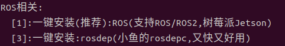

# 宇树go2仿真

在Gazebo中为宇树Go2机器人添加Velodyne雷达和D435i深度相机

环境:Ubuntu22.04,ROS2 humble 

## 环境配置

### 1.安装ros2 humble

```bash
wget http://fishros.com/install -O fishros && . fishros
```

主要安装1.3



### 2.安装依赖

```bash
sudo apt install ros-humble-gazebo-ros2-control
sudo apt install ros-humble-xacro
sudo apt install ros-humble-robot-localization
sudo apt install ros-humble-ros2-controllers
sudo apt install ros-humble-ros2-control
sudo apt install ros-humble-velodyne
sudo apt install ros-humble-velodyne-gazebo-plugins
sudo apt-get install ros-humble-velodyne-description
```

安装liosam依赖

```bash
sudo apt install ros-<ros2-version>-perception-pcl \
  	   ros-<ros2-version>-pcl-msgs \
  	   ros-<ros2-version>-vision-opencv \
  	   ros-<ros2-version>-xacro
```

```bash
# Add GTSAM-PPA
sudo add-apt-repository ppa:borglab/gtsam-release-4.1
sudo apt install libgtsam-dev libgtsam-unstable-dev
```

### 3.克隆代码

```bash
mkdir ~/go2_ws
cd go2_ws
git clone https://github.com/fishros/simdog.git -b main
sudo rosdepc init
rosdepc update
rosdepc install --from-paths src --ignore-src -r -y
colcon build --symlink-install 
```

构建好工程之后，然后启动文件

```bash
bash start.sh
```


## 代码修改

### 1.如果想要更换地图测试，请

```bash
cd ~/go2/src/unitree-go2-ros2/robots/configs/go2_config/launch
```

在gazebo_velodyne.launch.py中第37行修改为自己的地图


tips：为了能正确在gazebo中打开其他地图，请到https://github.com/osrf/gazebo_models 里下载模型文件到 ~/.gazebo/models下面，例如


### 2.想修改liosam的参数配置文件，请到

```bash
~/go2/src/LIO-SAM/config/params.yaml
```

根据需要可修改参数

